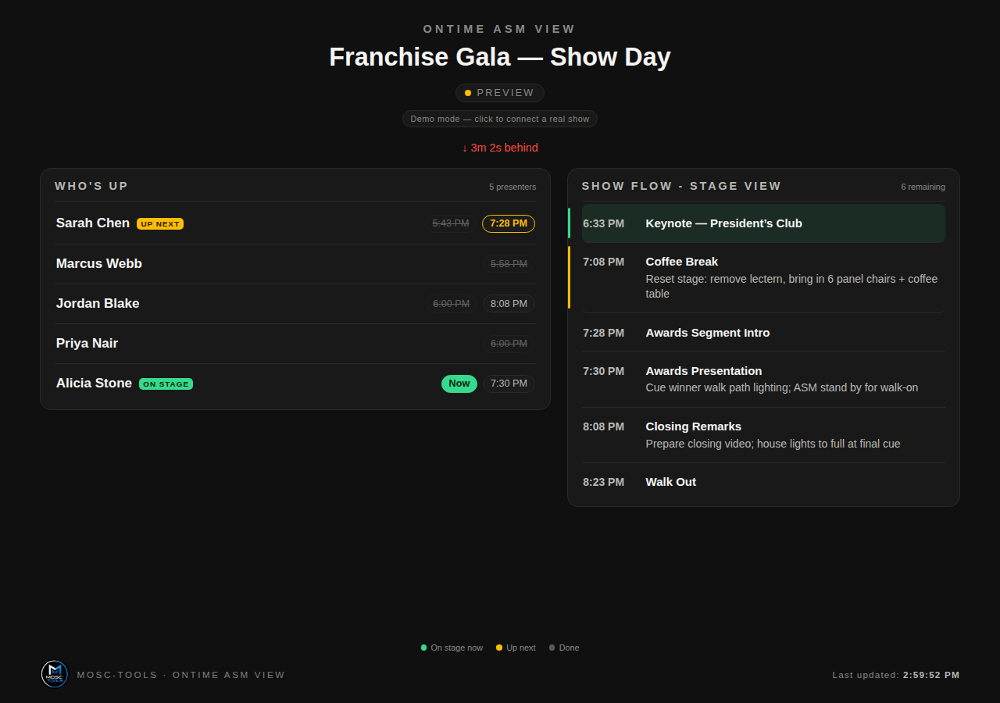
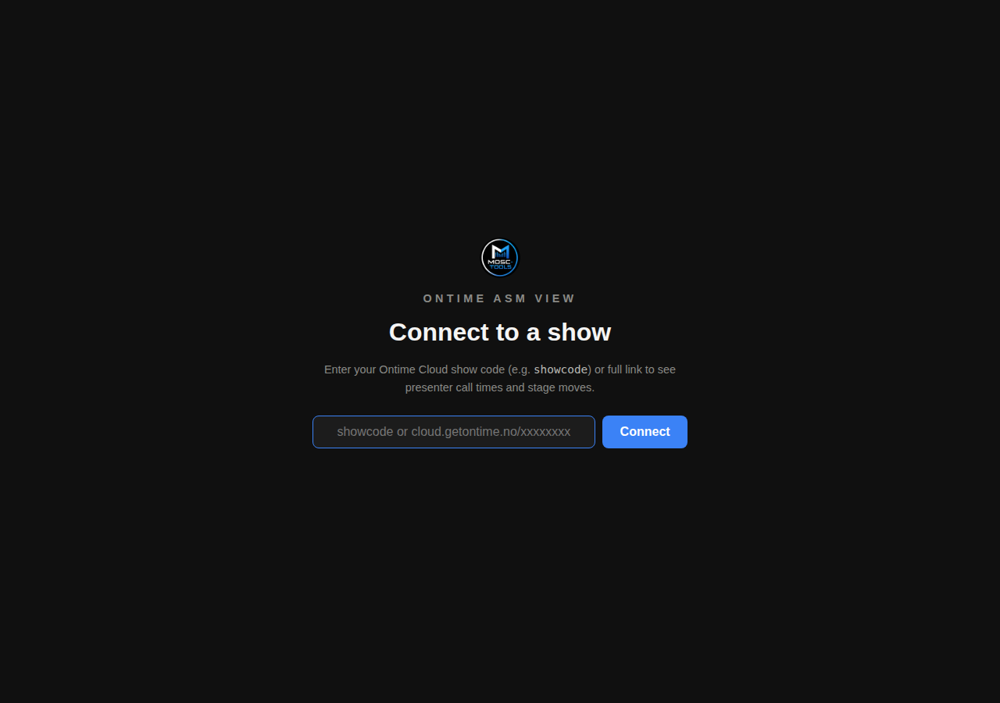
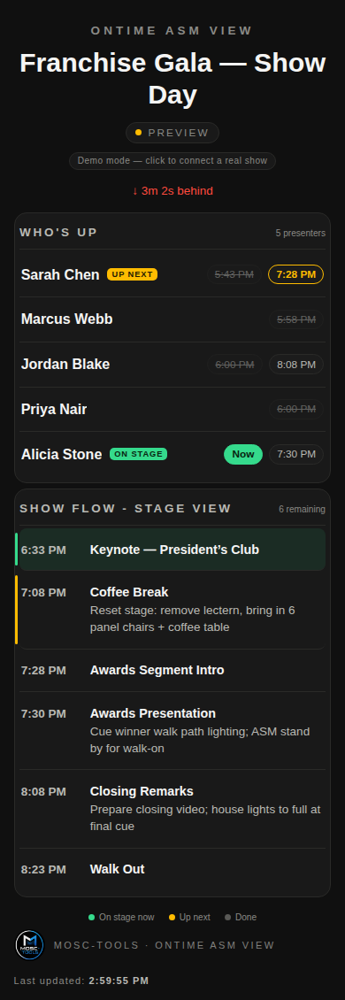

  

<h1 align="center">Mosc-tools — Ontime ASM View</h1>

  A mobile-friendly presenter call-time and stage cue board for <a href="https://www.getontime.no/">Ontime</a>. 
  Built for assistant stage managers — who's up, who's next, and what's coming on the stage flow, live.

  
  &nbsp;
  
  &nbsp;
  

## Why

Ontime's own views are built for the booth. Backstage, an assistant stage manager needs
one thing on their phone: who's walking to the stage next, and what's coming up after
them. This is that page — presenter call times and the stage-cue flow, both tracking live
as the show actually runs, not just the planned schedule.

Built to hand off: no login, no install, works on any phone.

## What you get

- **Who's Up** — every presenter in the rundown, clustered by their consecutive
  appearances, with a live status: **On stage now** (green), **Up next** (amber), or
  struck-through once they're done. Both the planned and actual (live-adjusted) call
  times are shown side by side.
- **Show Flow - Stage View** — every event in the rundown, not just the ones with a
  stage note. As the show plays, finished events drop off the list entirely; the
  currently running event floats to the top in green, the next one right below in
  amber, with a live count of what's left. Titles and stage notes wrap independently so
  long cue text never overflows.
- **Ahead/behind schedule indicator** — a plain offset line ("↓ 3m 2s behind" /
  "✓ On schedule" / "↑ 2m ahead"), colored red when behind and green when ahead.
- **First-run setup screen** — land on the page with no config and it asks for your
  Ontime Cloud show code (e.g. `showcode`) or full share link. No hardcoded show baked
  into the file.
- **Click-to-change link** — click the pill under the title any time to point the page
  at a different show; it's remembered in the browser for next time.
- **Live updates over WebSocket**, with automatic reconnect if the connection drops.

## Quick start

**Option 1 — just open it.** [Download the zip](https://github.com/professorpete/mosc-tools-ontime-asm-view/archive/refs/heads/main.zip),
unzip, and open `index.html` in any browser. On first load it'll ask for your Ontime Cloud
show code or link — paste it in and you're live.

Want to see it before you download? The [live demo](https://professorpete.github.io/mosc-tools-ontime-asm-view/?demo=1)
runs the exact same file with fake show data.

**Option 2 — host it anywhere.** It's a static file — any web server, S3 bucket, or GitHub
Pages works. Send your ASMs the URL once and they can bookmark it; the show link is saved
in their browser after the first visit.

**Skip the setup screen entirely.** If you're hosting it yourself, put the show code right
in the URL you send — `https://your-host.com/index.html?link=showcode` — and it lands
straight on the live board, never showing the "Connect to a show" screen at all.

### URL parameters

| Parameter | What it does | Default |
| --- | --- | --- |
| `?link=cloud.getontime.no/showcode` | Ontime Cloud show to connect to — accepts a bare code (`?link=showcode`) or the full link | — (asks on first load) |
| *(none — on-screen)* | Click the link pill to change the show without editing the URL; it's saved in the browser | — |
| `?demo=1` | Demo mode with fake show data (for testing looks) | off |

## How it talks to Ontime

- **WebSocket** for live updates: running/next cues, timers, presenter names, and the
  schedule offset. Reconnects automatically with backoff.
- **HTTP** for the rundown/project title.

## Make it yours

Colors live in one `:root` block at the top of `index.html` — background, the "behind
schedule" red, the "ahead of schedule" green, the "on stage"/"up next" accents. The logo
is embedded as a data URI (favicon, setup screen, footer) — swap in your own PNG and
re-encode to rebrand.

## Support

Questions or ideas: [mosc-tools@moscone.ca](mailto:mosc-tools@moscone.ca)

If this tool saved your show day, consider
[buying me a coffee](https://buymeacoffee.com/mosctools) ☕ — it keeps the Mosc-tools
side projects alive.

MIT licensed.
